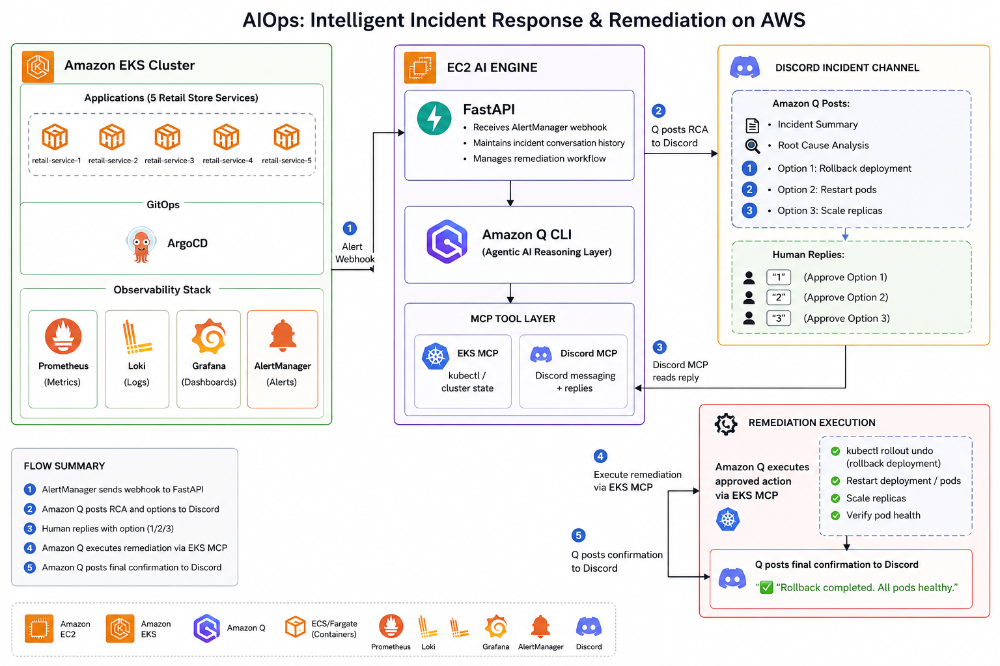
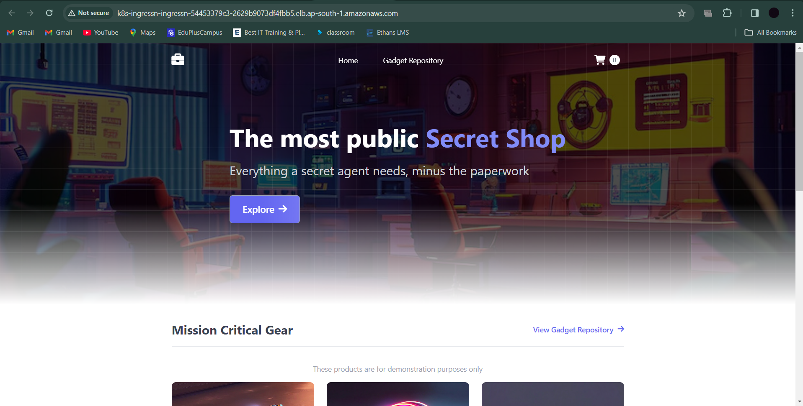
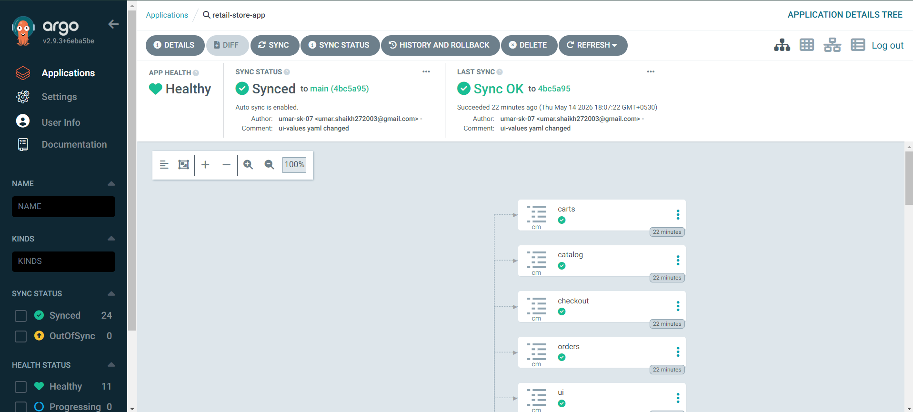
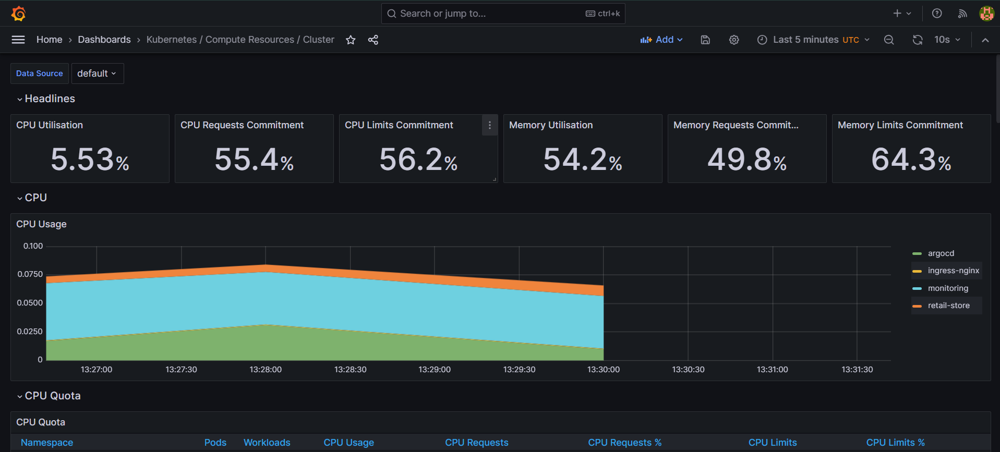
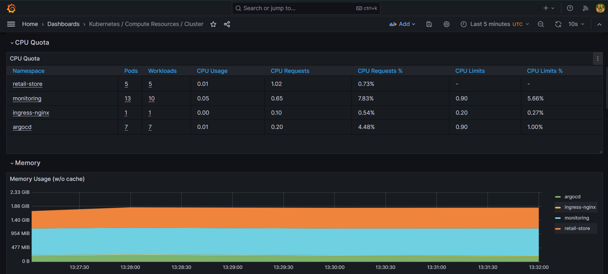
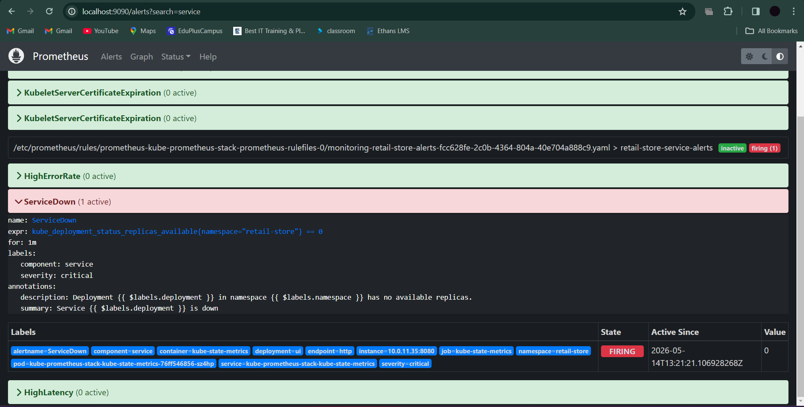
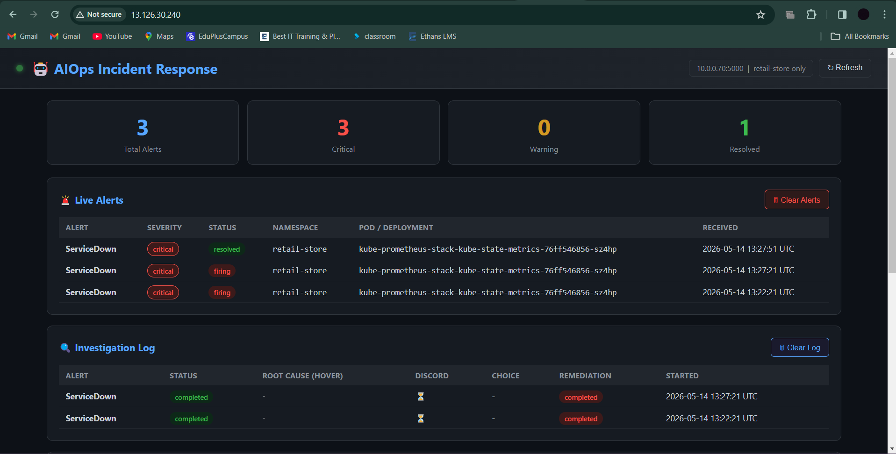
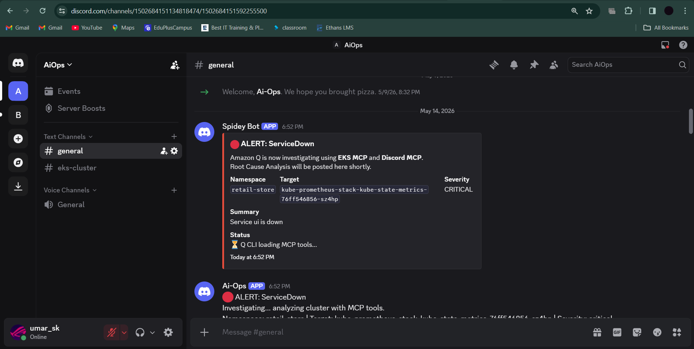
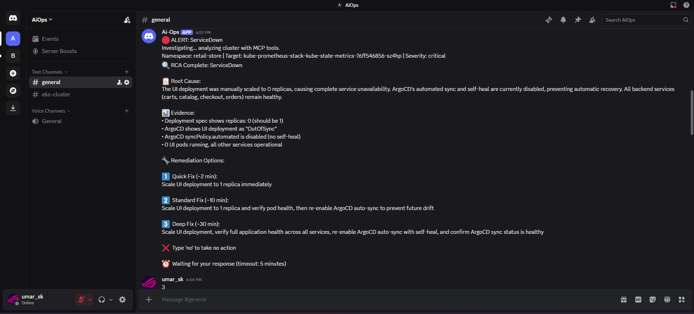

# AIOps: Intelligent Incident Response & Remediation on AWS

<div align="center">


[](./LICENSE)


**A production-grade Agentic AI platform where Amazon Q autonomously investigates Kubernetes incidents, performs root cause analysis, and executes human-approved remediations — all in real time.**

</div>

---

## What This Project Does

When a Kubernetes alert fires, most teams get paged and manually dig through logs, events, and metrics to figure out what broke. This project eliminates that manual loop.

**The full automated flow:**

1. AlertManager detects an issue in the EKS cluster and fires a webhook
2. A FastAPI server on EC2 receives the alert and triggers Amazon Q CLI
3. Amazon Q (agentic AI) investigates the cluster autonomously using MCP tools
4. Amazon Q posts a full Root Cause Analysis + 3 remediation options to Discord
5. A human replies with `1`, `2`, or `3` to approve an action
6. Amazon Q executes the approved remediation via EKS MCP
7. Amazon Q posts final confirmation to Discord

**No one touches `kubectl` manually. No one digs through logs. The AI does the investigation — humans make the call.**

---

## System Architecture



```
┌─────────────────────────────────────────────────────────────┐
│                        EKS CLUSTER                          │
├─────────────────────────────────────────────────────────────┤
│ Applications                                                │
│  ├── ui          (Java / Spring Boot)                       │
│  ├── catalog     (Go / Gin + MySQL)                         │
│  ├── cart        (Java / Spring Boot + DynamoDB)            │
│  ├── orders      (Java / Spring Boot + PostgreSQL)          │
│  └── checkout    (Node.js)                                  │
│                                                             │
│ GitOps                                                      │
│  └── ArgoCD                                                 │
│                                                             │
│ Observability Stack                                         │
│  ├── Prometheus                                             │
│  ├── Loki                                                   │
│  ├── Grafana                                                │
│  └── AlertManager                                           │
└──────────────────────────┬──────────────────────────────────┘
                           │ Alert webhook
                           ▼
┌─────────────────────────────────────────────────────────────┐
│                     EC2 AI ENGINE                           │
├─────────────────────────────────────────────────────────────┤
│ FastAPI :5000                                               │
│  ├── receives AlertManager webhook                          │
│  ├── maintains incident + investigation history             │
│  ├── serves live dashboard UI                               │
│  └── manages remediation workflow                           │
│                                                             │
│ Amazon Q CLI  (Agentic AI Reasoning Layer)                  │
│                                                             │
│ MCP TOOL LAYER                                              │
│  ├── EKS MCP       → kubectl / cluster state               │
│  └── Discord MCP   → Discord messaging + replies           │
└──────────────────────────┬──────────────────────────────────┘
                           │
                           ▼
┌─────────────────────────────────────────────────────────────┐
│                  DISCORD INCIDENT CHANNEL                   │
├─────────────────────────────────────────────────────────────┤
│ Amazon Q posts:                                             │
│  ├── Incident summary                                       │
│  ├── Root Cause Analysis                                    │
│  ├── Option 1: Quick Fix  (~2 min)                          │
│  ├── Option 2: Standard Fix  (~10 min)                      │
│  └── Option 3: Deep Fix  (~30 min)                          │
│                                                             │
│ Human replies:                                              │
│  ├── "1", "2", or "3" to approve                           │
│  └── "no" to take no action                                 │
└──────────────────────────┬──────────────────────────────────┘
                           │ Discord MCP reads reply
                           ▼
┌─────────────────────────────────────────────────────────────┐
│                 REMEDIATION EXECUTION                       │
├─────────────────────────────────────────────────────────────┤
│ Amazon Q executes approved action via EKS MCP               │
│  ├── kubectl rollout undo / restart                         │
│  ├── scale replicas                                         │
│  └── verify pod health                                      │
│                                                             │
│ Amazon Q posts final confirmation to Discord                │
│  "✅ Rollback completed. All pods healthy."                  │
└─────────────────────────────────────────────────────────────┘
```

---

## Application Architecture

The retail store is a 5-service microservices application — deliberately decoupled with different languages, databases, and Helm charts to simulate real enterprise complexity.


| Service | Language | Database | Description |
|---------|----------|----------|-------------|
| **UI** | Java 21 / Spring Boot 3.5 | — | Store frontend |
| **Catalog** | Go 1.23 / Gin | MySQL | Product catalog REST API |
| **Cart** | Java 21 / Spring Boot 3.5 | Amazon DynamoDB | Shopping cart API |
| **Orders** | Java 21 / Spring Boot 3.5 | PostgreSQL + RabbitMQ | Order processing API |
| **Checkout** | Node.js 20 | — | Checkout orchestration API |

All services expose Prometheus metrics, health check endpoints, and OpenTelemetry instrumentation.



---

## GitOps with ArgoCD

ArgoCD continuously reconciles the cluster against this Git repository. Any drift is automatically corrected.



```
Git Push → ArgoCD detects change → Helm renders manifests → Applied to EKS
                                          ↑
                               prune: true + selfHeal: true
```

ArgoCD is configured to watch `src/app/chart` and deploy to the `retail-store` namespace. Auto-sync with self-healing ensures the cluster always matches the desired state in Git.

```
argocd/
├── applications/
│   └── retail-store-app.yaml    # ArgoCD Application manifest
└── projects/
    └── retail-store-project.yaml
```

> **Note:** Before running manual remediation tests, disable ArgoCD auto-sync to prevent it from reverting your changes. Re-enable it after testing.

---

## Monitoring & Observability

```
monitoring/
├── prometheus-rules.yaml    # 8 alert rules for the retail-store namespace
├── alertmanager-config.yaml # Routes retail-store alerts to the AIOps webhook
├── podmonitor.yaml          # Prometheus scrape config for all 5 services
└── kustomization.yaml
```

### Alert Rules

| Alert | Severity | Condition |
|-------|----------|-----------|
| `PodCrashLooping` | Critical | >3 restarts in 15 min |
| `ServiceDown` | Critical | 0 replicas available for 1 min |
| `HighErrorRate` | Critical | >5% HTTP 5xx for 2 min |
| `PodNotReady` | Warning | Not Running for 5 min |
| `HighCPUUsage` | Warning | >80% CPU limit for 5 min |
| `HighMemoryUsage` | Warning | >80% memory limit for 5 min |
| `HighLatency` | Warning | p95 latency >1s for 5 min |
| `DeploymentReplicasMismatch` | Warning | Desired ≠ Available for 5 min |

AlertManager routes **only** `retail-store` namespace alerts to the AIOps webhook on EC2. Critical alerts fire immediately; warnings are grouped with a 30s delay.

### Grafana Dashboards





### Prometheus Alerts



---

## EC2 AI Engine — Deep Dive

The AI engine lives on an EC2 instance and consists of three components.

### 1. FastAPI Webhook Receiver (`webhook_receiver.py`)

Listens on port `5000` for AlertManager webhooks.

- Filters to `retail-store` namespace only — ignores all other namespaces
- Stores alert and investigation history in memory
- Spawns a background investigation task per firing alert
- Serves a live dashboard UI at `http://<EC2_IP>:5000`



**Key endpoints:**

| Endpoint | Method | Description |
|----------|--------|-------------|
| `/` | GET | Live dashboard UI |
| `/alert` | POST | AlertManager webhook receiver |
| `/api/alerts` | GET | Last 200 alerts (JSON) |
| `/api/investigations` | GET | Last 100 investigations (JSON) |
| `/health` | GET | Health check |

### 2. Investigation Orchestrator (`investigation_orchestrator.py`)

Bridges FastAPI and Amazon Q CLI.

1. Posts an immediate "investigating" notice to Discord via webhook (before Q even starts)
2. Builds a full prompt = `AMAZON_Q_PROMPT.txt` + live alert context (alert name, severity, namespace, target, cluster, region, channel ID)
3. Hands off entirely to Amazon Q CLI with `--no-interactive --trust-all-tools`
4. Q handles everything from here: investigation → RCA → Discord post → poll for reply → remediation → confirmation
5. Updates the investigation record with the outcome

Q CLI runs with a 10-minute timeout — enough for investigation (variable) + 5-minute human wait + remediation.

### 3. Discord Bot (`discord_bot.py`)

A separate always-on Discord bot that lets engineers query the cluster directly from Discord at any time — outside of incident response.

- Listens in a dedicated command channel
- Passes any message to Amazon Q CLI with cluster context pre-loaded
- Returns Q's response back to Discord (with ANSI stripping and 2000-char truncation)
- Useful for ad-hoc queries: "how many pods are running?", "what's the CPU usage of catalog?"

---

## AIOps Incident Response — Full Workflow

### The Agentic Investigation Loop

Amazon Q doesn't follow a fixed script. It reasons about the alert type and runs targeted checks using the `AMAZON_Q_PROMPT.txt` master prompt.

**Always checked:**
- Current pod status in `retail-store` namespace
- Recent events for the affected pod/deployment
- Pod logs (current + previous container if restarted)
- Deployment replica status

**Checked based on alert type:**
- Node resource pressure → for CPU/memory alerts
- HPA status → for replica mismatch alerts
- Rollout history → for crash or error rate alerts
- Dependency service health → for latency alerts (e.g. if checkout is slow, also checks orders and cart)
- ArgoCD sync status → for any deployment-related alert

### What Discord Sees

**Immediate notification (posted by Python before Q starts):**



**RCA + remediation options (posted by Amazon Q after investigation):**



**Example RCA message:**
```
🔍 RCA Complete: PodCrashLooping

📋 Root Cause:
OOMKilled — container memory limit (256Mi) exceeded under load.
Exit code 137 confirmed. Previous container logs show heap exhaustion.

📊 Evidence:
- kube_pod_container_status_restarts_total: 5 in last 10 min
- Last exit reason: OOMKilled
- Memory usage: 98% of limit at time of crash

🔧 Remediation Options:

1️⃣  Quick Fix (~2 min):
Delete and restart the affected pod

2️⃣  Standard Fix (~10 min):
Scale deployment to 0 then back up, verify all pods healthy

3️⃣  Deep Fix (~30 min):
Patch memory limits on deployment, verify stability, re-enable ArgoCD auto-sync

❌  Type 'no' to take no action
⏰  Waiting for your response (timeout: 5 minutes)
```

**After human replies `"2"`:**
```
✅ Remediation Complete: PodCrashLooping

Action Taken: Scaled deployment to 0, then back to 2 replicas
Result: All pods Running and Ready
Verification: 2/2 replicas available, no restarts in last 2 min
```

### Approval Boundaries

| Operation | Approval Required |
|-----------|------------------|
| `kubectl get`, `describe`, `logs`, `top`, `events` | Never — read-only, always permitted |
| Posting to Discord | Never |
| `kubectl delete`, `scale`, `patch`, `rollout restart` | Always — human must reply first |
| ArgoCD sync or rollback | Always |
| No human response within 5 min | Auto-exit, no action taken |

---

## Repository Structure

```
retail-store-sample-app/
├── src/
│   ├── app/chart/          # Umbrella Helm chart (deploys all 5 services)
│   ├── ui/                 # Java Spring Boot frontend
│   ├── catalog/            # Go/Gin catalog service
│   ├── cart/               # Java Spring Boot cart service
│   ├── orders/             # Java Spring Boot orders service
│   └── checkout/           # Node.js checkout service
│
├── argocd/
│   ├── applications/
│   │   └── retail-store-app.yaml   # ArgoCD Application manifest
│   └── projects/
│       └── retail-store-project.yaml
│
├── monitoring/
│   ├── prometheus-rules.yaml       # 8 alert rules
│   ├── alertmanager-config.yaml    # Webhook routing to EC2
│   ├── podmonitor.yaml             # Prometheus scrape config
│   └── kustomization.yaml
│
├── EC2-files/aiops/
│   ├── webhook_receiver.py         # FastAPI server + dashboard
│   ├── investigation_orchestrator.py  # Q CLI bridge
│   ├── discord_bot.py              # Always-on Discord bot
│   ├── AMAZON_Q_PROMPT.txt         # Master prompt for Amazon Q
│   ├── requirements.txt            # Python dependencies
│   └── .env                        # Discord + AWS credentials
│
└── docs/images/                    # Architecture diagrams + screenshots
```

---

## Getting Started

### Prerequisites

| Tool | Version | Purpose |
|------|---------|---------|
| AWS CLI | v2+ | Cluster access |
| kubectl | 1.33+ | Kubernetes CLI |
| Helm | 3.0+ | Chart deployments |
| Python | 3.10+ | EC2 AI engine |
| Amazon Q CLI | latest | Agentic AI layer |

### 1. Configure AWS

```bash
aws configure
# Enter: Access Key, Secret Key, Region (ap-south-1), output format (json)
```

### 2. Configure kubectl for your EKS cluster

```bash
aws eks update-kubeconfig --name <your-cluster-name> --region ap-south-1
kubectl get nodes
```

### 3. Deploy the application via ArgoCD

Update `argocd/applications/retail-store-app.yaml` with your repo URL, then apply:

```bash
kubectl apply -f argocd/applications/retail-store-app.yaml
kubectl apply -f argocd/projects/retail-store-project.yaml
```

ArgoCD will automatically sync and deploy all 5 services to the `retail-store` namespace.

```bash
# Verify all pods are running
kubectl get pods -n retail-store
```

### 4. Access ArgoCD

```bash
# Get admin password
kubectl -n argocd get secret argocd-initial-admin-secret \
  -o jsonpath='{.data.password}' | base64 -d

# Port-forward
kubectl port-forward svc/argocd-server -n argocd 8080:443
# Open https://localhost:8080 — username: admin
```

### 5. Deploy monitoring configuration

Update `monitoring/alertmanager-config.yaml` — replace the webhook URL with your EC2 instance's private IP:

```yaml
receivers:
  - name: 'aiops-receiver'
    webhook_configs:
      - url: 'http://<YOUR_EC2_PRIVATE_IP>:5000/alert'
```

Then apply:

```bash
kubectl apply -f monitoring/prometheus-rules.yaml
kubectl apply -f monitoring/podmonitor.yaml
kubectl apply -f monitoring/alertmanager-config.yaml

# Restart AlertManager to pick up the new config
kubectl rollout restart statefulset \
  alertmanager-kube-prometheus-stack-alertmanager -n monitoring
```

### 6. Access observability UIs

```bash
# Grafana (admin / prom-operator)
kubectl port-forward -n monitoring svc/kube-prometheus-stack-grafana 3000:80
# http://localhost:3000

# Prometheus
kubectl port-forward -n monitoring svc/kube-prometheus-stack-prometheus 9090:9090
# http://localhost:9090

# AlertManager
kubectl port-forward -n monitoring svc/kube-prometheus-stack-alertmanager 9093:9093
# http://localhost:9093
```

### 7. Set up the EC2 AI Engine

SSH into your EC2 instance and run:

```bash
# Install dependencies
cd ~/aiops
pip install -r requirements.txt

# Configure environment variables
# Edit .env with your Discord webhook URL, bot token, channel ID, and AWS region
nano .env
```

**Required `.env` values:**

| Variable | Description |
|----------|-------------|
| `DISCORD_WEBHOOK_URL` | Discord channel webhook URL for posting embeds |
| `DISCORD_CHANNEL_ID` | Channel ID where Q polls for human replies |
| `DISCORD_BOT_TOKEN` | Bot token for the Discord bot (polling + discord_bot.py) |
| `AWS_REGION` | AWS region of your EKS cluster |

```bash
# Start the FastAPI webhook receiver (runs on port 5000)
uvicorn webhook_receiver:app --host 0.0.0.0 --port 5000

# In a separate terminal, start the Discord bot
python discord_bot.py
```

Open `http://<EC2_IP>:5000` to see the live incident dashboard.

### 8. Verify the end-to-end flow

```bash
# Trigger a test alert — scale down a service (disable ArgoCD auto-sync first)
kubectl patch application retail-store-app -n argocd --type merge \
  -p '{"spec":{"syncPolicy":null}}'

kubectl scale deployment ui -n retail-store --replicas=0

# Watch Discord — you should see:
# 1. Immediate "investigating" notice
# 2. RCA with 3 remediation options (within ~60s)
# Reply with "1", "2", or "3" to approve

# Re-enable ArgoCD after testing
kubectl patch application retail-store-app -n argocd --type merge \
  -p '{"spec":{"syncPolicy":{"automated":{"prune":true,"selfHeal":true}}}}'
```

---

## Monitoring Setup Guide

For a detailed walkthrough of the monitoring stack — including how to verify Prometheus targets, test each alert type, and troubleshoot webhook delivery — see the [Monitoring README](./monitoring/README.md).

---

## Tech Stack

| Category | Technologies |
|----------|-------------|
| **Cloud** | AWS (EKS, EC2, VPC, DynamoDB, ECR, IAM) |
| **Orchestration** | Kubernetes 1.33, EKS Auto Mode |
| **GitOps** | ArgoCD, Helm |
| **Ingress** | NGINX Ingress Controller, NLB |
| **Monitoring** | Prometheus, Grafana, AlertManager |
| **Logging** | Loki, Promtail |
| **Tracing** | OpenTelemetry |
| **AIOps Engine** | Amazon Q CLI (agentic), FastAPI, Python |
| **MCP Tools** | EKS MCP (`awslabs.eks-mcp-server`), Discord MCP |
| **Languages** | Java 21, Go 1.23, Node.js 20, Python 3.10+ |
| **Frameworks** | Spring Boot 3.5, Gin, Express |
| **Databases** | MySQL, PostgreSQL, Amazon DynamoDB, RabbitMQ |

---

## License

Apache License 2.0 — see [LICENSE](./LICENSE) for details.
